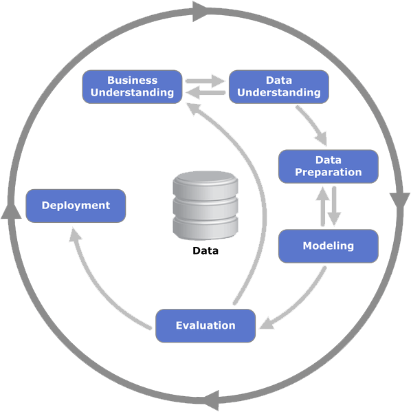

# Practical Application Assignment 11.1: What Drives the Price of a Car?

## Background

As part of the UC Berkeley Professional Certificate in Machine Learning
and Artificial Intelligence (UC Berkeley, 2022), this assignment is the
second of three Modules designed to test our new skills. We are to use the Cross Industry Standard Process for Data Mining (CRISP-DM) method
(Schröer, et al, 2021) of data analysis, see Figure 1 below, on a
dataset of car prices.

Figure 1: The Cross Industry Standard Process for Data Mining (CRISP-DM)

**CRISP-DM**

The CRISP-DM (Cross-Industry Standard Process for Data Mining) approach
to data analysis involves six major steps as outlined below:

- Understanding the Business: This initial step involves conducting an
  in-depth analysis of the business objectives and needs. It includes
  assessing the current situation, defining goals based on insights, and
  setting up a plan to proceed.

- Understanding the Data: In this phase, data is collected from various
  sources, its format and type are determined, and the data is profiled.
  Tasks include exploring the data, describing it, and ensuring its
  quality, accuracy, and validity.

- Data Preparation: Careful selection, cleansing, construction, and
  formatting of the data are carried out in this step. The data is
  organized for modeling, and information exploration is conducted to
  identify patterns aligned with business insights.

- Modeling: The modeling phase involves selecting modeling techniques,
  generating test scenarios for validation, building various models, and
  assessing them to ensure alignment with business objectives

- Evaluation: During this phase, the results of the models are evaluated
  against business intentions. Multiple models are assessed to determine
  which one best meets the project's goals.

- Deployment/Communication: The final step involves presenting the
  gathered information in a usable manner to stakeholders according to
  their expectations and business requirements. This phase may vary in
  complexity based on numerous factors.

## Scope of this Assignment

As this is the second Module that involves a practical application of the
data analysis, this assignment only covers the first three sections of
the CRISP-DM methodology: Understanding the Business, Understanding the Data, Data Preparation, and Modeling.

## Understanding the Business

Understanding which vehicle features increase the price of a vehicle is crucial for a used vehicle dealer for several reasons:

1. **Pricing Strategy**: Knowledge of value-adding features allows dealers to price their vehicles competitively and accurately. They can ensure a fair profit margin while still offering attractive prices to customers.

2. **Inventory Selection**: Dealers can make informed decisions about which cars to acquire for their inventory. By focusing on vehicles with features that are in high demand, they can turn over their inventory more quickly and efficiently.

3. **Sales Focus**: When interacting with customers, salespeople can highlight the features that justify a car's price, helping to validate the value proposition to potential buyers.

4. **Market Trends**: Awareness of which features are currently increasing a car's value helps dealers stay ahead of market trends and adapt their sales strategies accordingly.

5. **Trade-in Evaluations**: When appraising vehicles for trade-in, dealers must understand the impact of various features on a car's value to offer fair trade-in prices that protect their bottom line.

6. **Targeted Marketing**: Dealers can tailor their marketing efforts to emphasize the most valuable features of their vehicles, attracting buyers who are willing to pay more for those specific attributes.

7. **Customer Satisfaction**: By understanding and meeting customer demand for certain features, dealers can improve customer satisfaction and potentially generate repeat business and referrals.

In summary, knowing which features increase a car's price helps used vehicle dealers manage their business more effectively, from inventory acquisition and pricing to sales strategies and customer service (Muller, 2017).

**Business Objectives**

The business objective is to assess a database of used cars that contain their selling price and a list of features of the car. By analyzing this data, we can evaluate the price of the vehicle in comparison with the listed features of the car. Using this information, we are to build a model that can be used to evaluate other cars that we may want to sell in the used vehicle lots.

## Data Understanding

Various tools and resources are used for conducting the Data
Understanding step.

**Dataset**

The dataset used for this assignment was provided as part of the
assignment in a Comma Separated Values (CSV) format.

The dataset is organized in a tabular fashion with each row representing
a single vehicle and its features along with the price of the car.

As described in the assignment, the attributes of this dataset include:

Car attributes

* 'id' - a unique number assigned to this car,
* 'region' - the region within a state where the vehicle is located.
* 'price' - the current selling price of the car.
* 'year' - the year the vehicle was manufactured.
* 'manufacturer' - the vehicle manufacturer.
* 'model' - the model of the car.
* 'condition' - the condition of the car.
* 'cylinders' - the number of cylinders in the engine of this car.
* 'fuel' - the type of fuel required to operate this car.
* 'odometer' - the current mileage reading on the car's odometer.
* 'title_status' - indicates if there is a clear title to this car.
* 'transmission' - the type of transmission in the car.
* 'VIN' - the vehicle id number assigned to this car.
* 'drive' - whether this is a rear drive or 4 wheel drive vehicle.
* 'size' - the size of the car.
* 'type' - the type of car.
* 'paint_color' - the color of the car.
* 'state' - the U.S. state in which this vehicle is located.

## EDA

### Average Price Chart
The chart below depicts the range of prices for the cars in the dataset. The distribution of prices has a peak to the left of the mean price of $15,955.

The distribution appears to be right-skewed, with a long tail extending towards higher prices. This suggests that while most of the cars are clustered around the mean price, there is a significant number of cars with higher prices, which could represent luxury or high-performance vehicles.

The plot does not show a clear indication of a bimodal distribution, which would be characterized by two distinct peaks. Instead, there is one clear peak and a gradual decline in density as the price increases. The presence of a long tail towards the higher prices suggests that there are  a smaller cluster of higher-priced cars.

### Violin Plot
A Violin Plot is a visual tool that displays the price distribution of each feature in the dataset. The shape of the violin is determined by the variation of prices that are in the dataset for that feature as it relates to the price of the car.

From the violin plot, we can infer the following conclusions about the distribution of car prices with respect to different features:
##### Manufacturer:
 There is variation in price distribution among different manufacturers. Some manufacturers have a wider range of prices, while others have a more concentrated distribution, indicating that certain manufacturers may cater to different market segments.
##### Model:
 The price distribution varies significantly across different car models. Some models have a wide distribution, suggesting a range of options at different price points, while others are more concentrated.
##### Condition:
Cars in excellent condition tend to have a higher median price and a wider distribution, indicating a range of prices within the 'excellent' category. Cars in lower condition categories have a more concentrated distribution, with lower median prices.
##### Transmission:
 Automatic transmission cars have a wider price distribution compared to manual transmission cars, which could suggest a higher demand or a greater variety of features and models available with automatic transmissions.
##### Drive:
 The distribution of prices for cars with different drive types (fwd, rwd) shows variation, with some drive types having a wider range of prices.
##### Size:
 Compact cars have a more concentrated price distribution, while full-size cars have a wider distribution, indicating a greater variety of price points within the full-size category.
##### Cylinders:
 The number of cylinders is associated with different price distributions. Cars with more cylinders tend to have a higher median price and a wider distribution, which may reflect higher performance or luxury models.
##### Type:
 Different car types (sedan, SUV, truck, etc.) have distinct price distributions, with some types having a wider range of prices, which could be due to differences in utility, features, and market demand.
##### Color:
 The distribution of prices also varies by color, with some colors having a wider distribution than others, which might reflect consumer preferences or the availability of certain colors in higher-end models.
##### Area:
 The area feature shows different price distributions, which could indicate regional variations in car prices due to factors like demand, economic conditions, or availability.
##### Odometer Range:
 Cars with different odometer readings show varying price distributions, with newer cars (lower odometer readings) generally having higher prices.
##### Summary
These insights from the violin plot can be valuable for understanding the factors that influence car prices.
Further analysis will determine which features have the most impact on car prices.

### Box Plot
### Box Plot Analysis
From the box plot, we can infer the following conclusions about the distribution of car prices with respect to different features

#### Manufacturer:
 There is variation in price distribution among different manufacturers. Some manufacturers have a wider range of prices, while others have a more concentrated distribution, indicating that certain manufacturers may cater to different market segments.
#### Model:
 The price distribution varies significantly across different car models. Some models have a wide distribution, suggesting a range of options at different price points, while others are more concentrated.
#### Condition:
 Cars in excellent condition tend to have a higher median price and a wider distribution, indicating a range of prices within the 'excellent' category. Cars in lower condition categories have a more concentrated distribution, with lower median prices.
#### Transmission:
 Automatic transmission cars have a wider price distribution compared to manual transmission cars, which could suggest a higher demand or a greater variety of features and models available with automatic transmissions.
#### Drive:
 The distribution of prices for cars with different drive types (fwd, rwd) shows variation, with some drive types having a wider range of prices.
#### Size:
 Compact cars have a more concentrated price distribution, while full-size cars have a wider distribution, indicating a greater variety of price points within the full-size category.
#### Cylinders:
 The number of cylinders is associated with different price distributions. Cars with more cylinders tend to have a higher median price and a wider distribution, which may reflect higher performance or luxury models.
#### Type:
 Different car types (sedan, SUV, truck, etc.) have distinct price distributions, with some types having a wider range of prices, which could be due to differences in utility, features, and market demand.
#### Color:
 The distribution of prices also varies by color, with some colors having a wider distribution than others, which might reflect consumer preferences or the availability of certain colors in higher-end models.
#### Area:
 The area feature shows different price distributions, which could indicate regional variations in car prices due to factors like demand, economic conditions, or availability.
#### Odometer Range:
 Cars with different odometer readings show varying price distributions, with newer cars (lower odometer readings) generally having higher prices.

These insights from the box plot can be valuable for understanding the factors that influence car prices and can inform the feature selection and engineering process in machine learning model development. By identifying the features with the most significant impact on price, we can prioritize these for inclusion in the model to improve its predictive accuracy. Additionally, understanding the distribution of prices can help in detecting outliers and in transforming features to better capture the underlying patterns in the data.

## Modeling
After reviewing the data, several models were created to determine the impact of the various features in the dataset on the price. Several regression models were created and tested.
The following types of models were tested:
*   Linear Regression
*   Ridge
*   LASSO

*   Degree 2
*   Degree 3

Also, Cross Validation techniques were used to verify the models and to determine which model would be best at predicting the price of a car in a new dataset:

*   K-Fold Cross VValidation
*   GridSearchCV

After the modeling, we evaluatede the R2 and MSE to determine the best model that can be used to predict car prices.

 ### Evaluation of Model Scores
 To determine the best model, we should look for the one with the highest Test Score and Test R2, and the lowest Test RMSE and Test MAE, as these metrics indicate the model's performance on unseen data (the test set).

 To determine which of the above models is better, we need to consider several performance metrics: Train Score, Test Score, Train RMSE (Root Mean Squared Error), Test RMSE, Train MAE (Mean Absolute Error), Test MAE, Train R2 (R-squared), and Test R2. The better model will generally have higher Train and Test Scores, lower RMSE and MAE values, and higher R2 values, as these indicate a good fit to the data and good generalization to unseen data.

The models have been evaluated using k-fold cross-validation. The models include Lasso, Linear Regression, and Ridge regression algorithms, each with four folds of cross-validation.

Considering the Test Scores and Test R2 as primary indicators of model performance on unseen data:

- **Lasso Regression (Lasso_kfold)**: The Lasso models have Test Scores ranging from approximately 0.78 to 0.80 and Test R2 values in a similar range. The RMSE and MAE values are relatively consistent across the folds.

- **Linear Regression (LinearRegression_kfold)**: The Linear Regression models have Test Scores and Test R2 values that are comparable to the Lasso models, with scores also ranging from approximately 0.78 to 0.80.

- **Ridge Regression (Ridge_kfold)**: The Ridge models show slightly higher Test Scores and Test R2 values compared to Lasso and Linear Regression, with scores ranging from approximately 0.79 to 0.81.

Based on these metrics, the Ridge Regression models (Ridge_kfold) perform slightly better than the Lasso and Linear Regression models. They have the highest Test Scores and Test R2 values, which suggests they are better at generalizing to unseen data. The consistency across the folds also indicates that the Ridge models are stable.

Although the performance metrics between the models are relatively small, the Ridge models show a slight edge. The Ridge Regression models are the better choice for predicting car prices due to their slightly superior performance on the test data.

## Polynomial Regression Models

In Addition to the Linear Regression Models, second and third degreee models were also evalauated:

  * MSE (degree 2): 9.840996747761279e+20
  * R-squared (degree 2): -3.2826279095430986e+22

  * MSE (degree 3): 4.000255226230118e+20
  * R-squared (degree 3): -1.3343515690019781e+22

#### Polynomial Model Comparison
##### MSE
The Degree 2 polynomial model has a slightly lower MSE than the Degree 3 model, indicating it has a marginally better fit in terms of the average squared errors.
##### R2
The Degree 2 model also has a less negative R2 value compared to the Degree 3 model, suggesting it does a slightly less poor job of explaining the variance in the dependent variable.

#### Summary
The Degree 2 polynomial model is marginally better than the Degree 3 model. However, both models exhibit signs of poor performance, and indicate that a Polynomial model is not the best model for predictions of this dataset.

### Feature Importance

## Findings

This Jupyter Notebook provides an analysis of various factors that influence used car prices, which is essential for a used car dealership to understand consumer preferences and inform pricing strategy. The analysis includes data cleaning and preprocessing to ensure the dataset's quality for reliable insights.

From the box plot analysis, it is evident that the distribution of car prices varies significantly across different features such as manufacturer, model, condition, transmission, drive, size, cylinders, type, color, area, and odometer range. For instance, cars from certain manufacturers have a wider price range, indicating a diverse market segment. Similarly, the condition of a car affects its price, with cars in excellent condition having a higher median price. The type of transmission also influences the price, with automatic cars having a wider distribution, possibly due to higher demand or more features.

The evaluation of model scores reveals that the RandomForestRegressor_baseline model is the most effective for predicting car prices, with the highest test score and R2 value, and relatively low test RMSE and MAE. In contrast, the Lasso_baseline and LinearRegression_baseline models perform poorly, with negative R2 values on the test set.The degree 2 polynomial model is marginally better than the degree 3 model, but both show signs of poor performance relative to the Random Forest Model.

The Feature Importance Plot indicates that the year of the vehicle is the most significant predictor of price, followed by the manufacturer and odometer range. Other features like the model, drive, cylinders, transmission, and condition also contribute to the prediction but to a lesser extent.

The Price Distribution plot shows a right-skewed distribution with a peak to the left of the mean price, suggesting that while most cars are priced around the mean, there is a significant number of higher-priced cars, possibly luxury or high-performance vehicles. The long tail towards higher prices indicates a smaller cluster of higher-priced cars.

In conclusion, the analysis provides valuable insights into the factors that influence car prices and highlights the importance of selecting features with higher importance for better sales predictions.

## Next Steps

The next steps in this process will be the Evaluation, and
Deployment/Communication steps in the CRISP-DM methodology. These steps will require skills that we currently have not studied, but we are looking forward to learning these techniques.

## References

Muller, D. (2017, November 14). How equipment choices affect a car’s resale value. Weighing Your Options: How Equipment Choices Affect a Car’s Resale Value. https://www.caranddriver.com/news/a15338786/weighing-your-options-how-equipment-choices-affect-a-cars-resale-value/

Schröer, Christoph & Kruse, Felix & Marx Gómez, Jorge. (2021). A
Systematic Literature Review on Applying CRISP-DM Process Model.
Procedia Computer Science. 181. 526-534. 10.1016/j.procs.2021.01.199.

UC Berkeley. (August 30, 2022). “UC Berkeley Professional Certificate in
Machine Learning and Artificial Intelligence”. UC Berkeley.
https://em-executive.berkeley.edu/professional-certificate-machine-learning-artificial-intelligence
